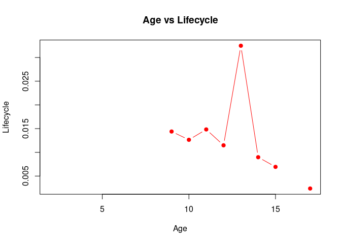
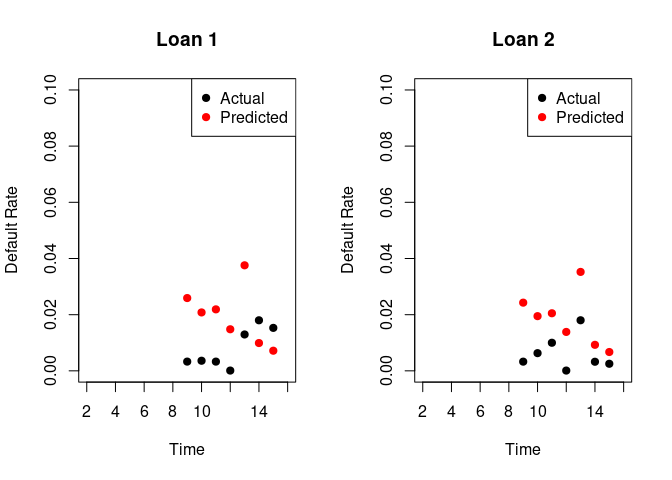
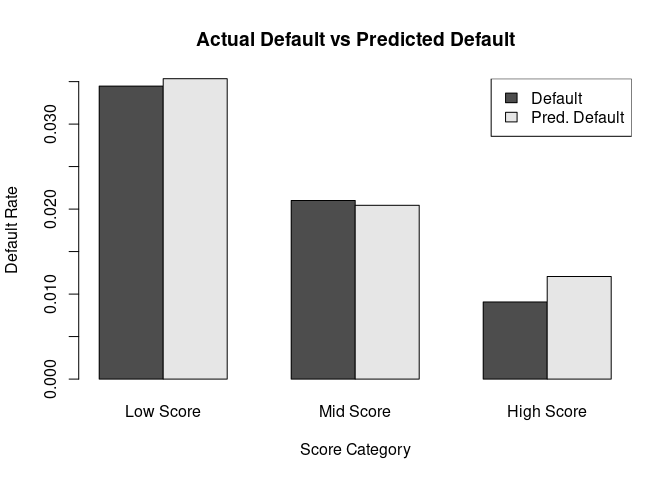

Moody’s Analytics Coding Test
================
Said Maanan
2022-06-19

## Introduction

In this document I present my solution to the Moody’s Analytics Coding
Test for Candidates.

## Problem 1

The first step to answering the questions in the first problem is to
load the data frame `data.csv`:

``` r
library(readr)
data <- read_csv("~/Downloads/Coding_Test/data.csv")
```

The `readr` package tells us that the data frame consists of 5 variables
and 13646 observations. Now we can start answering our questions.

### Question 1

Generate the variable `age` for each loan:

``` r
library(lubridate)
data$age = - round(interval(today(), ymd(data$time, truncated = 2)) / years(1))
```

What is the maximum age of the default rate observed in the sample?

``` r
max(data$age)
```

    ## [1] 17

The maximum age of non-missing default rate observed in the sample is 17
years.

### Question 2

Create a table reporting the summary statistics for `default_rate`:

``` r
summary(data$default_rate)
```

    ##    Min. 1st Qu.  Median    Mean 3rd Qu.    Max.    NA's 
    ##   0.000   0.002   0.006   0.015   0.015   0.510   11274

Percentage of missing cells:

``` r
sum(is.na(data$default_rate))/length(data$default_rate)*100
```

    ## [1] 82.61762

### Question 3

Generate the variable `lifecycle`:

``` r
library(tidyverse)
```

``` r
data <- data %>% 
  group_by(age) %>% 
  mutate(lifecycle = mean(default_rate, na.rm = TRUE))
```

Plot `lifecycle` over age using line chart:

``` r
plot(unique(data[,c("age","lifecycle")]), type = "b", pch = 19, col = "red",
     main = "Age vs Lifecycle",
     xlab = "Age",
     ylab = "Lifecycle")
```

<!-- -->

``` r
 library(ggplot2)
 library(gridExtra)
```

### Question 4

Pick two loans with the default rate observed for at least five periods.

``` r
book_1 = data[data$account_id=='400293',]
book_2 = data[data$account_id=='401749',]
```

For each loan, plot the lifecycle of the default rate.

``` r
par(mfrow=c(1,2))

plot(x = book_1$age, y = book_1$default_rate, type = "b", pch = 19, col = "red",
     main = "Loan 1",
     xlab = "Age",
     ylab = "Default rate")

plot(x = book_2$age, y = book_2$default_rate, type = "b", pch = 19, col = "red",
     main = "Loan 2",
     xlab = "Age",
     ylab = "Default rate")
```

<!-- -->

Do the two loans follow the portfolio’s lifecycle?

``` r
par(mfrow=c(1,2))

plot(x = book_1$age, y = book_1$default_rate, type = "b", pch = 19, col = "red", ylim = c(0, 0.035),
     main = "Loan 1",
     xlab = "Age",
     ylab = "Default rate")

points(unique(data[,c("age","lifecycle")]), type = "p", pch = 19, col = "black")

lines(unique(data[,c("age","lifecycle")]), lty = 2, col="black")

plot(x = book_2$age, y = book_2$default_rate, type = "b", pch = 19, col = "red", ylim = c(0, 0.08),
     main = "Loan 2",
     xlab = "Age",
     ylab = "Default rate")

points(unique(data[,c("age","lifecycle")]), type = "p", pch = 19, col = "black")

lines(unique(data[,c("age","lifecycle")]), lty = 2, col="black")
```

<!-- -->

The first account `400293` seems to align closely with the portfolio’s
lifecycle, but the second account `401749` doesn’t.

### Question 5

Estimate a fixed-effect model for the `default_rate` as target variable
and `age` and `r12_gdp` as fixed effects:

``` r
library(fixest)
mod_bl <- feols(default_rate ~ account_id | age^r12_gdp_bl, data = data)
summary(mod_bl)
```

    ## OLS estimation, Dep. Var.: default_rate
    ## Observations: 2,372 
    ## Fixed-effects: age^r12_gdp_bl: 8
    ## Standard-errors: Clustered (age^r12_gdp_bl) 
    ##             Estimate Std. Error  t value Pr(>|t|)    
    ## account_id -1.34e-08   6.46e-09 -2.07982 0.076106 .  
    ## ---
    ## Signif. codes:  0 '***' 0.001 '**' 0.01 '*' 0.05 '.' 0.1 ' ' 1
    ## RMSE: 0.033706     Adj. R2: 0.031225
    ##                  Within R2: 0.002527

``` r
mod_st <- feols(default_rate ~ account_id | age^r12_gdp_bl, data = data)
summary(mod_st)
```

    ## OLS estimation, Dep. Var.: default_rate
    ## Observations: 2,372 
    ## Fixed-effects: age^r12_gdp_bl: 8
    ## Standard-errors: Clustered (age^r12_gdp_bl) 
    ##             Estimate Std. Error  t value Pr(>|t|)    
    ## account_id -1.34e-08   6.46e-09 -2.07982 0.076106 .  
    ## ---
    ## Signif. codes:  0 '***' 0.001 '**' 0.01 '*' 0.05 '.' 0.1 ' ' 1
    ## RMSE: 0.033706     Adj. R2: 0.031225
    ##                  Within R2: 0.002527

Obtain predictions

``` r
fitted_bl = mod_bl$fitted.values
fitted_st = mod_st$fitted.values
```

How can you ensure that the predictions are bounded between 0 and 1

``` r
mod_bound = feglm(default_rate ~ account_id | age + r12_gdp_bl, data = data, family = "quasibinomial")
summary(mod_bound$fitted.values)
```

    ##     Min.  1st Qu.   Median     Mean  3rd Qu.     Max. 
    ## 0.000000 0.009233 0.012878 0.014966 0.018803 0.038136

``` r
mod_bound_st = feglm(default_rate ~ account_id | age + r12_gdp_st, data = data, family = "quasibinomial")
```

Plot the actual vs the predicted values of the default rate for the two
loans selected previously

``` r
#plot(fitted_bl, data[unlist(mod_bl$obs_selection),]$default_rate)
#plot(fitted_st, data[unlist(mod_st$obs_selection),]$default_rate)

f_1 = mod_bound$fitted.values
plot(f_1, data[unlist(mod_bound$obs_selection),]$default_rate)
```

<!-- -->

``` r
pred_1 = predict(mod_bound, book_1)
pred_2 = predict(mod_bound, book_2)

df_1 = data.frame(Age = book_1$age, Actual = book_1$default_rate, Predicted = pred_1)
df_2 = data.frame(Age = book_2$age, Actual = book_2$default_rate, Predicted = pred_2)

par(mfrow=c(1,2))

plot(x = df_1$Age, y = df_1$Predicted, type = "p", pch = 19, col = "red",
     main = "Loan 1",
     xlab = "Time",
     ylab = "Default rate")

points(x = df_1$Age, df_1$Actual, type = "p", pch = 19, col = "black")

legend("topright", c("Actual","Predicted"), col=c("black","red"), pch=c(19,19))

plot(x = df_2$Age, y = df_2$Predicted, type = "p", pch = 19, col = "red",
     main = "Loan 2",
     xlab = "Time",
     ylab = "Default rate")

points(x = df_2$Age, df_2$Actual, type = "p", pch = 19, col = "black")

legend("topright", c("Actual","Predicted"), col=c("black","red"), pch=c(19,19))
```

<!-- -->

## Problem 2

### Question 1

``` r
library(readr)
mortgages_small <- read_csv("~/Downloads/Coding_Test/mortgages_small.csv")
```

How many observations in the data set?

``` r
nrow(mortgages_small)
```

    ## [1] 61583

How many loans in the data set?

``` r
length(levels(as.factor(mortgages_small$loan_id)))
```

    ## [1] 5000

What is the time coverage in terms of months?

``` r
library(lubridate)

min(ym(mortgages_small$obs_month))
```

    ## [1] "2014-04-01"

``` r
max(ym(mortgages_small$obs_month))
```

    ## [1] "2019-03-01"

### Question 2

Create a table reporting the number of loans and percentage of loans per
month.

``` r
mortgages_small$obs_m = ym(mortgages_small$obs_month)
mortgages_small$month = month(mortgages_small$obs_m)

monthly_loans = mortgages_small %>%
  group_by(month) %>%
  dplyr::summarise(n = n())

monthly_loans$prc = monthly_loans$n/sum(monthly_loans$n)*100

monthly_loans
```

    ## # A tibble: 12 × 3
    ##    month     n   prc
    ##    <dbl> <int> <dbl>
    ##  1     1  5255  8.53
    ##  2     2  5232  8.50
    ##  3     3  5305  8.61
    ##  4     4  4727  7.68
    ##  5     5  4639  7.53
    ##  6     6  4733  7.69
    ##  7     7  5036  8.18
    ##  8     8  5141  8.35
    ##  9     9  5408  8.78
    ## 10    10  5410  8.78
    ## 11    11  5391  8.75
    ## 12    12  5306  8.62

Create a bar plot showing the number of loans at each observation date.

``` r
barplot(monthly_loans$n,
        main = "Loans vs Months",
        xlab = "Months",
        ylab = "Loans",
        names.arg = 1:12)
```

<!-- -->

### Question 3

Create a table reporting the number and share of observations per
origination year.

``` r
mortgages_small$ori_y = ym(mortgages_small$orig_date)
mortgages_small$year = year(mortgages_small$ori_y)

yearly_loans = mortgages_small %>%
  group_by(year) %>%
  dplyr::summarise(n = n())

yearly_loans$prc = yearly_loans$n/sum(yearly_loans$n)*100

yearly_loans
```

    ## # A tibble: 9 × 3
    ##    year     n      prc
    ##   <dbl> <int>    <dbl>
    ## 1  2010    47  0.0763 
    ## 2  2012   119  0.193  
    ## 3  2013  1215  1.97   
    ## 4  2014  2747  4.46   
    ## 5  2015 24062 39.1    
    ## 6  2016 33072 53.7    
    ## 7  2017    13  0.0211 
    ## 8  2018   304  0.494  
    ## 9  2019     4  0.00650

Create a bar plot showing the number of loans at each origination date.

``` r
barplot(yearly_loans$n,
        main = "Loans vs Years",
        xlab = "Years",
        ylab = "Loans",
        names.arg = yearly_loans$year)
```

<!-- -->

### Question 4

Create a new variable that is the first observation date of each
account.

``` r
library(dplyr)

mortgages_small =  mortgages_small %>%
  group_by(loan_id) %>%
  mutate(first_obs = min(obs_m)) %>%
  ungroup()
```

Create and summarize the observation lag.

``` r
mortgages_small$obs_lag = - interval(ymd(mortgages_small$obs_m), ymd(mortgages_small$first_obs)) / days(1)
summary(mortgages_small$obs_lag)
```

    ##    Min. 1st Qu.  Median    Mean 3rd Qu.    Max. 
    ##     0.0    92.0   243.0   336.4   518.0  1461.0

### Question 5

Merge `macro.csv` and `mortgages.csv`

``` r
macros <- read_csv("~/Downloads/Coding_Test/macros.csv")
macros$date = ym(macros$date)
merged = merge(x = mortgages_small, y = macros, by.x = "obs_m", by.y = "date", all = TRUE)
```

### Question 6

Create an indicator variable `default_flag`.

``` r
merged = mutate(merged, default_flag = ifelse(arrears >= 3, 1, 0))
```

### Question 7

Create a single table reporting the summary statistics.

``` r
merged %>% 
    select(default_flag, current_balance, current_ltv, credit_score, original_ltv, hpi_o, hpi_t) %>% 
    map_df(.f = ~ broom::tidy(summary(.x)), .id = "variable")
```

    ## # A tibble: 7 × 8
    ##   variable        minimum       q1   median        mean      q3  maximum    na
    ##   <chr>             <dbl>    <dbl>    <dbl>       <dbl>   <dbl>    <dbl> <dbl>
    ## 1 default_flag        0        0        0        0.0254      0        1     NA
    ## 2 current_balance     0   103112.  183480.  246831.     343463. 3106990.    NA
    ## 3 current_ltv         0       67.3     82.2     83.4       101.     804.  1857
    ## 4 credit_score      428      626      679      673.        727      825   3810
    ## 5 original_ltv       50.1     75       80       79.0        80      150.    NA
    ## 6 hpi_o              76.5    180.     217.     198.        222.     226.    NA
    ## 7 hpi_t             108.     159.     181.     184.        213.     226.    NA

### Question 8

Tabulate the variables `arrears`, `mortgage_type` and `occupancy`.

``` r
library(janitor)
df = data_frame(merged$arrears, merged$mortgage_type, merged$occupancy)
apply(df, 2, tabyl)
```

    ## $`merged$arrears`
    ##  newX[, i]     n      percent
    ##          0 52124 0.8464024163
    ##          1  5523 0.0896838413
    ##          2  2371 0.0385008850
    ##          3  1538 0.0249744248
    ##          4    27 0.0004384327
    ## 
    ## $`merged$mortgage_type`
    ##  newX[, i]     n   percent valid_percent
    ##     bullet 19958 0.3240829     0.3598305
    ##        erm 17326 0.2813439     0.3123772
    ##     linear 18181 0.2952276     0.3277923
    ##       <NA>  6118 0.0993456            NA
    ## 
    ## $`merged$occupancy`
    ##       newX[, i]     n   percent valid_percent
    ##             btl 12296 0.1996655     0.2302449
    ##    holiday home 27996 0.4546060     0.5242304
    ##  owner occupied 13112 0.2129159     0.2455247
    ##            <NA>  8179 0.1328126            NA

### Question 9

Remove missing observations from the data set.

``` r
merged$d_hpi = merged$hpi_t - merged$hpi_o
merged = na.omit(merged)
```

### Question 10

Partition the data set into partition and test samples

``` r
library(caret)
set.seed(1219)

merged$default_flag = as.factor(merged$default_flag)
ind   = createDataPartition(merged$mortgage_type, p=0.8,list = F)
train = merged[ind,]
test  = merged[-ind,]
```

### Question 11

Estimate a logit model.

``` r
log_mod = glm(default_flag ~ credit_score + occupancy + current_ltv + mortgage_type + gdp_t + d_hpi, data = train, family = binomial)
```

### Question 12

Interpret the coefficients of the model.

``` r
summary(log_mod)
```

    ## 
    ## Call:
    ## glm(formula = default_flag ~ credit_score + occupancy + current_ltv + 
    ##     mortgage_type + gdp_t + d_hpi, family = binomial, data = train)
    ## 
    ## Deviance Residuals: 
    ##     Min       1Q   Median       3Q      Max  
    ## -1.2403  -0.2517  -0.2008  -0.1602   3.2992  
    ## 
    ## Coefficients: (1 not defined because of singularities)
    ##                           Estimate Std. Error z value Pr(>|z|)    
    ## (Intercept)             -0.3141823  0.3271496  -0.960    0.337    
    ## credit_score            -0.0058573  0.0004913 -11.922  < 2e-16 ***
    ## occupancyholiday home    0.0478583  0.0883556   0.542    0.588    
    ## occupancyowner occupied  0.0636683  0.1694982   0.376    0.707    
    ## current_ltv              0.0052939  0.0008734   6.061 1.35e-09 ***
    ## mortgage_typeerm                NA         NA      NA       NA    
    ## mortgage_typelinear     -0.0119153  0.1400673  -0.085    0.932    
    ## gdp_t                   -0.1166713  0.0160846  -7.254 4.06e-13 ***
    ## d_hpi                   -0.0071028  0.0010951  -6.486 8.83e-11 ***
    ## ---
    ## Signif. codes:  0 '***' 0.001 '**' 0.01 '*' 0.05 '.' 0.1 ' ' 1
    ## 
    ## (Dispersion parameter for binomial family taken to be 1)
    ## 
    ##     Null deviance: 7965.0  on 33304  degrees of freedom
    ## Residual deviance: 7582.5  on 33297  degrees of freedom
    ## AIC: 7598.5
    ## 
    ## Number of Fisher Scoring iterations: 7

### Question 13

Generate predicted default rates from the model.

``` r
train$pred_default = log_mod$fitted.values
```

### Question 14

In-sample model validation.

Plot average predicted vs average actual over time.

``` r
train$default_flag = as.numeric(as.character(train$default_flag))
agg_1 = train %>% group_by(obs_m) %>% summarise_at(vars(default_flag, pred_default), mean)

plot(agg_1$obs_m, agg_1$default_flag,
     main = "Actual Default vs Predicted Default",
     xlab = "Time",
     ylab = "Default rate",
     type = "o", col  = "blue", pch=20,
     )
lines(agg_1$obs_m, agg_1$pred_default, 
      lty = 2, col="red")

points(agg_1$obs_m, agg_1$pred_default,
       col="red", pch = 18)

legend("topright", c("Actual","Predicted"), lty = c(1,2), col=c("blue","red"), pch=c(20,18))
```

<!-- -->

Create 3 categories of borrower credit score.

``` r
train = mutate(train, bcs = ifelse(credit_score<= 650, "low-score", ifelse(credit_score > 650 & credit_score <= 800, "mid-score", "high-score")))

agg_2 = train %>% group_by(bcs) %>% summarise_at(vars(default_flag, pred_default), mean)

barplot(t(as.matrix(agg_2[,-1])),
        main = "Actual Default vs Predicted Default",
        xlab = "Score Category",
        ylab = "Default Rate",
        names.arg = c("High Score", "Low Score", "Mid Score"),
        col = gray.colors(2),
        beside = TRUE)
legend("topleft",
       c("Default", "Pred. Default"),
       fill = gray.colors(2))
```

<!-- -->

### Question 15

Generate out-of-sample predictions.

``` r
test$oos_pred = predict(log_mod, test, type = "response")

test$default_flag = as.numeric(as.character(test$default_flag))
```

Plot average predicted vs average actual over time.

``` r
agg_3 = test %>% group_by(obs_m) %>% summarise_at(vars(default_flag, oos_pred), mean)

plot(agg_3$obs_m, agg_3$default_flag,
     main = "Actual Default vs Predicted Default",
     xlab = "Time",
     ylab = "Default rate",
     type = "o", col  = "blue", pch=20,
     )
lines(agg_3$obs_m, agg_3$oos_pred, 
      lty = 2, col="red")

points(agg_3$obs_m, agg_3$oos_pred,
       col="red", pch = 18)

legend("topright", c("Actual","Predicted"), lty = c(1,2), col=c("blue","red"), pch=c(20,18))
```

<!-- -->

### Question 16

Create `outcome` variable.

``` r
test = mutate(test, outcome = ifelse(oos_pred > 0.1, 1, 0))

# test$outcome = as.factor(test$outcome)
```

### Question 17

Create confusion matrix.

``` r
library(InformationValue)
optimal = optimalCutoff(test$default_flag, test$outcome)[1]
confusionMatrix(test$default_flag, test$outcome)
```

    ##      0   1
    ## 0 8051 208
    ## 1   64   3

### Question 18

Create a receiver operating curve.

``` r
library(PRROC)
PRROC_obj <- roc.curve(scores.class0 = test$oos_pred, weights.class0=test$default_flag, curve=TRUE)
plot(PRROC_obj)
```

<!-- -->
